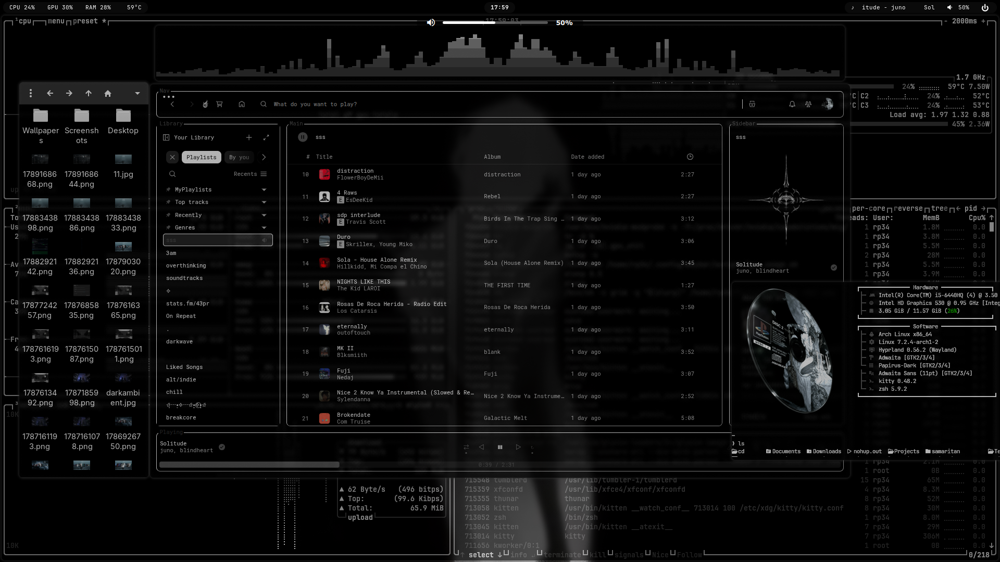
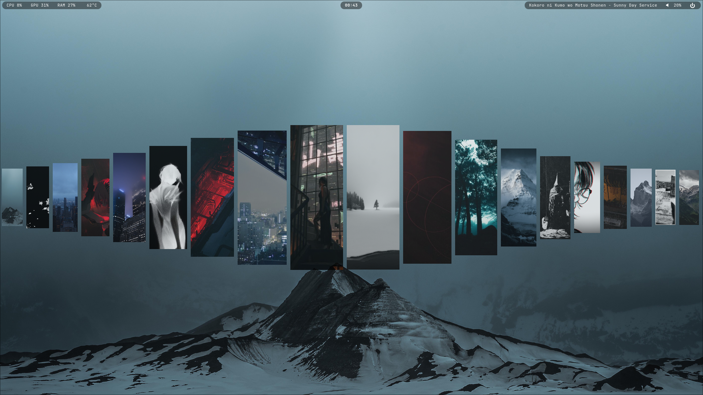
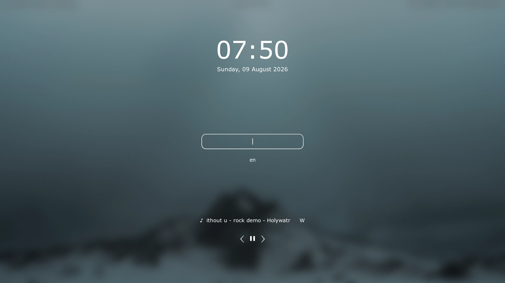

## Simple Hyprland Setup

Showcase & Guides: https://www.youtube.com/@43PR2

Hyprland setup focused on practical keybinds, productivity, and a smooth workflow easy to customize

Feel free to use as inspiration or as a starting point for building your own setup.

### `Recent updates`

```text
quickshell   → volume OSD 
waybar       → media marquee effect
hyprlock     → autohide media controls
terminal     → eza icons + starship + zsh shell
terminal     → fastfetch + autosuggestions + syntax-highlighting
```






Wallpapers: https://wallhaven.cc/user/43pr

## Features

* Waybar > Change volume with mouse wheel, mute, play/pause, next and blue light filter
* Rofi > App search, clipboard history and switch opacity
* Hyprlock (Lock screen)
* Wlogout (Logout menu)
* Custom scripts
* Custom monochrome theme
* Custom wallpaper selector (Quickshell)
* Spotify + Spicetify. Theme: text by darkthemer (edited)

### Wallpaper Selector

Just made some tweaks to it. Give it some love 

> Inspired by [hyprquickpaper](https://github.com/iamsurjog/hyprquickpaper)

### Most used keybinds

> **You can modify the keybinds using HyprMod**

| Keybind                 | Action                    |
| -----------             | ------------------------- |
| `Super + T`             | Terminal                  |
| `Super + Q`             | Close active window       |
| `Super + 1, 2, 3..`     | Change workspaces         |
| `Super + Shift + 1, 2..`| Move window to workspace  |
| `Super + D`             | Application launcher      |
| `Super + E`             | File manager              |
| `Super + B`             | Browser                   |
| `Super + W`             | Wallpaper selector        |
| `Super + O`             | Switch opacity            |
| `Super + V`             | Clipboard history         |          
| `Super + F`             | Toggle fullscreen         |
| `Super + Space`         | Toggle floating window    |
| `Super + Shift + W`     | Toggle waybar             |
| `Super + Tab`           | Lock screen               |
| `Super + Grave`         | Logout menu               |
| `Super + Mouse wheel`   | Zoom                      |

> **All keybinds: config/hypr/keybinds.lua**

---
## Installation 

> **READ ALL**

This is mainly intended for a clean installation. If you already have a desktop configuration, you should implement it manually instead.

Should work for Arch, Manjaro, EndeavourOS, CachyOS, etc. Let me know if there's any issues

> **First install git then clone the repository and run the installer:**

```bash

sudo pacman -S git   
```
```bash

git clone https://github.com/43PR/dotfiles.git
cd dotfiles
chmod +x install.sh
./install.sh
```

> **After the installation finishes log out and back in.**

Existing configuration files that are being replaced will be backed up automatically.

Edit default programs in "config/hypr/hyprland.lua".

Any issues with the wallpaper picker just delete cache pictures ".cache/quickshell/thumbs/"

**☕ Support: https://ko-fi.com/43pr2**

---

* [hyprquickpaper](https://github.com/iamsurjog/hyprquickpaper)
* [samaritan-sddm-theme](https://github.com/omerwk/samaritan-sddm-theme)


